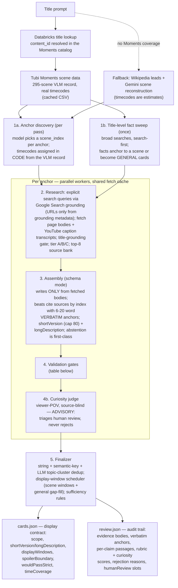

# SceneIQ Scene Fact Pipeline

Orchestration pipeline for the SceneIQ GenAI model layer (per the SceneIQ GenAI
Model PRD). You enter a movie prompt; the pipeline returns validated, sourced
**Scene Fact** cards — insider details about things physically visible or
audible on screen.

**Tubi Moments stand-in:** scene anchoring normally comes from Tubi Moments VLM
output. For now, Stage 1 uses Gemini grounded search to reconstruct the film's
scene structure. When Moments is wired in, only `pipeline/anchors.py` changes —
the rest of the pipeline consumes `Anchor` objects and doesn't care where they
came from.

## Setup

```bash
cd sceneiq-pipeline
python3.12 -m venv .venv
source .venv/bin/activate
pip install -r requirements.txt
export GEMINI_API_KEY=your-key
```

## Usage

```bash
python -m sceneiq "Legally Blonde (2001)"
```

Options:

| Flag | Default | Meaning |
|---|---|---|
| `--title-lookup` | off | resolve the prompt to a content_id in the Moments catalog, fetch scenes from Databricks |
| `--content-id` | — | fetch Moments scenes for an explicit Tubi content_id |
| `--moments PATH` | — | use a local Moments export (CSV from the warehouse or prototype JSON) |
| `--passes` | 1 | discovery passes; anchors dedupe across passes, approved cards merge |
| `--evidence` | relaxed | `relaxed` or `strict` (safety/spoiler gates identical in both) |
| `--max-anchors` | 12 | candidate anchors per pass |
| `--max-cards` | 10 | cap on scene cards (general cards uncapped, bounded by sweep) |
| `--workers` | 8 | parallel anchor workers |
| `--strict-verbatim` | off | hard-reject on named-entity verbatim misses |
| `-o, --out-dir` | `data/outputs` | where JSON lands |

Outputs:

- **stdout** — the `sceneFacts` array (card contract JSON). Cards carry
  `scope` ("scene" | "general"), `shortVersion`/`longDescription`, and
  `displayWindows` — the exact [start, end] segments during which the player
  may show each card. Scene cards get their scene window (+pad); general
  cards (title-level facts, no scene tie) fill every remaining gap, floored
  at their spoiler boundary. `titleEnablement.timeCoverage` reports covered
  fraction and any uncovered gaps; full coverage is an enablement rule.
- `data/outputs/<title>.cards.json` — cards + title-enablement decision + run stats
- `data/outputs/<title>.review.json` — every candidate's full journey (anchor,
  evidence packet, sources with tiers/evidence classes, per-check validation
  results, rejection reasons) for the HITL review surface

## Pipeline architecture



### Validation gates (stage 4), in order

| # | Gate | Mechanism | Relaxed mode | Strict mode |
|---|---|---|---|---|
| 1 | Contract | code: 3-5 beats, short <= 80 chars, category enum | reject | reject |
| 2 | Source binding | code: per-beat verbatim anchor fuzzy-matches its fetched source body (>= 0.8); video beats get `sourceTimestamp` from transcript timing | drop bad beats (card survives with >= 3) | reject |
| 3 | Claim entailment | judge (temp 0, same excerpts the writer saw): every name/number/causal claim supported; per-claim supporting passage extracted | drop bad beats | reject |
| 4 | Summary entailment | judge: shortVersion/longDescription may not exceed the verified beats | reject | reject |
| 5 | Film specificity | judge: generic industry practice is not a Scene Fact | reject | reject |
| 6 | Conformance | judge rubric auto-0: plot summary, character backstory, casting stories (incl. executive-request framing), deleted scenes | reject | reject |
| 7 | Spoiler boundary | judge `earliest_safe_fraction` vs anchor position (scene cards); general cards get a scheduling floor instead | reject | reject |
| 8 | Safety | judge: G-rated (censored profanity fails), no talent/partner disparagement, quoting criticism of the title fails | reject | reject |
| 9 | Verbatim entities + cross-modal | code: named entities string-checked in bodies; video-sourced entities need a text source | flag | flag (reject with `--strict-verbatim`) |
| 10 | Emission policy | code: C-tier never supports; evidence classes judged per claim | 1 primary OR 1 editorial | 1 primary OR 2 independent A/B editorial |
| 11 | Rubric disposition | judge 0/1/2 rubric | floors of 1 (accuracy, grounding, conformance) | 2s on accuracy+grounding, >= 1 elsewhere, avg >= 1.5 |

Every card records `wouldPassStrict` (the full strict verdict) regardless of mode,
so relaxed output can be re-gated without re-running. Viewer value is scored by
humans in `review.json` (`humanReview` block); the model curiosity score only
prioritizes review. Failing any hard gate rejects with a machine-readable reason,
aggregated by `python -m sceneiq report`.

## PRD alignment status

Scope note: **movies only** — episodic content is out of scope for this cut.

### Aligned

| PRD requirement | Where |
|---|---|
| Common evidence-first workflow; taxonomy as labels, not generators | single anchor→research→assemble path |
| 7-category taxonomy | `config.FACT_CATEGORIES`, enforced in schemas + judge |
| Card contract (+ `sourceModality`, `spoilerBoundary`) | `models.SceneFactCard.to_contract_dict()` |
| Source tiers A/B/C | `config.*_TIER_DOMAINS`, `tiers.classify_domain` |
| Evidence classes by nature of evidence, not platform | judge in `pipeline/validate.py` (editorial article with direct participant quote → primary) |
| Emission rules (1 primary or 2 independent editorial; C never supports) | `validate.py` step 6 |
| Discovery leads (Wikipedia API, C-tier, seed-only) | `pipeline/leads.py` |
| Spoiler boundary (timecode-relative, earliest-safe fraction) | judge output → card `spoilerBoundary` |
| No AI-invented content / abstention | entailment per beat + abstain in assembly |
| G-rated maturity / partner & talent safety | judge `safety_pass` |
| 6-dimension 0/1/2 rubric + card disposition rule (2s on accuracy & grounding, ≥1 elsewhere, avg ≥1.5) | `validate.py` step 7 |
| Per-claim supporting passage in review record | judge `supporting_passage` → `claim_evidence` in review.json |
| Video sources: transcript as searchable layer + cross-modal corroboration | `_fetch_transcript` + `cross_modal` check |
| Title sufficiency (1 card/10 min, ≥6 cards, quartile coverage, ≤40%/quartile, ≥2 categories) | `orchestrator.run` finalizer, per-rule report |
| Source-yield study metrics (per title, never blended) | `python -m sceneiq report` — cards/hour, approval by category AND evidence class, thirds+quartiles, rejection buckets |
| Viewer value scored by humans (PRD rubric) | `humanReview` block per candidate in review.json; report aggregates human scores; model curiosity scores are advisory triage only (`curiosity_gating=False`) |
| Deep/fast model split, schema mode, tenacity retries | `gemini.py` |

### Not aligned — called out

- **Scene grounding is LLM-judged, not VLM-verified.** The PRD's "present in
  the anchored scene, checked against VLM output" check needs Tubi Moments;
  until then the judge scores `scene_grounding` from a search-derived scene
  description. This is the biggest precision risk in the current cut.
- **Source independence is registered-domain only.** The PRD's anti-syndication
  rule ("not derived from the same press release/interview") has no dedicated
  tracer; two outlets quoting one interview can still count as independent.
- **IMDb licensed data (A-tier credits) is not integrated.** IMDb prohibits
  scraping and has no free API; the PRD requires IMDb Essential Metadata via
  AWS Data Exchange — a licensing decision. Wikipedia leads partially fill the
  discovery role; TMDb's free API is the other interim option.
- **Video content is verified via caption transcripts, not by watching.**
  Caption-less videos never enter the source bank (unverifiable). Beats citing
  video sources get `sourceTimestamp` via fuzzy alignment of their verbatim
  anchor against transcript segment timing. True video verification (Gemini
  video-understanding on the YouTube URL) remains a Phase 4 optimization,
  gated to already-passing cards to bound cost.
- **No gold-set machinery.** Dev/frozen-regression/held-out/adversarial sets,
  regression runs, and the two-reviewer human rubric are process assets that
  don't exist yet; the automated rubric is a stand-in, not a replacement — the
  PRD's viewer-safe precision thresholds are measured by humans, not by this
  pipeline grading itself.
- **Human review is not optional yet.** Per PRD Phase A, nothing this pipeline
  emits should reach a viewer without per-card human review until thresholds
  are met on a frozen regression set.
- Easter Egg pipeline not included (stretch goal; slots in as a sibling of
  `pipeline/assemble.py` behind the same validator).

### Verbatim-check caveat

Named-entity matching runs against fetched HTML or YouTube caption transcripts;
paywalls and bot-blocking (403s) mean flag-don't-reject by default. Use
`--strict-verbatim` to hard-gate. ASR noise on proper nouns (the PRD's own
caveat) is partially mitigated by the cross-modal rule: video-sourced entities
must also appear in a text source.
